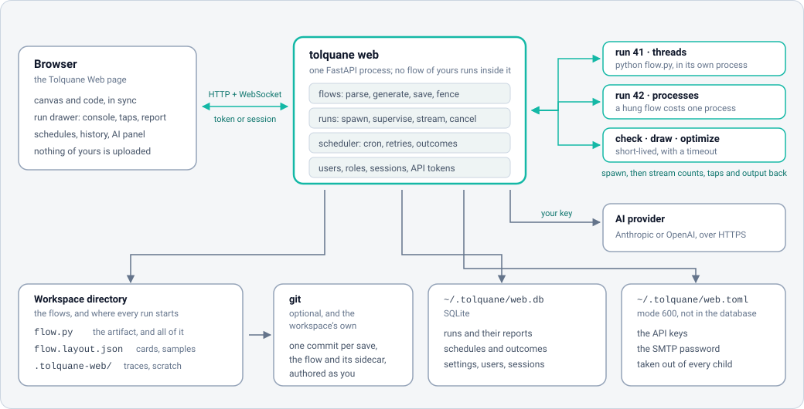

# Deploying Tolquane Web

Tolquane Web runs flows. It is a program that executes Python you give it, with the
privileges of whoever started it. Everything below is a way of deciding who that is and
who can reach the page.

Four shapes, in the order most people meet them:

| Where | How | Who can get in |
|---|---|---|
| Your own machine | `tolquane web` | you, because only this machine can reach it |
| A machine you `ssh` into | `tolquane web` plus a tunnel | whoever can log in to that machine |
| A shared machine | a service on loopback, accounts, a proxy for HTTPS | whoever has an account |
| A container | Docker or compose, a token, a proxy for HTTPS | whoever has the token or an account |

## What a deployment is made of



One process serves the page and the API. Every run, check, draw and optimize happens in
a child process of its own, so a flow that hangs or crashes costs one process and the
server keeps answering. Three things on disk outlive the server:

- **the workspace**, the directory of `flow.py` files (with their layout sidecars, and a
  git repository if you want history);
- **`$TOLQUANE_HOME/web.db`**, SQLite: runs, schedules, settings, users and sessions;
- **`$TOLQUANE_HOME/web.toml`**, mode 600: the API keys and the SMTP password.

`TOLQUANE_HOME` is `~/.tolquane` unless you set it. Nothing else is state.

## On your own machine

```
pip install "tolquane[web]"
cd ~/flows
tolquane web
```

That listens on `127.0.0.1:8765`, opens a browser and takes the current directory as the
workspace. No login: only this machine can reach the port. `--workspace DIR`, `--port N`
and `--no-browser` change the obvious things, and `tolquane web --check` starts the
server, asks `/api/health` and stops, which is the line for CI.

The first account turns sign-in on, even here. See
[Users and sign-in](web-user.md#users-and-sign-in).

## On a machine you log in to

The best answer for one person on a remote machine is not to expose anything. Leave the
server on loopback and bring the port to you:

```
ssh -L 8765:127.0.0.1:8765 host      # then open http://127.0.0.1:8765/ at home
```

Everything is inside the SSH connection, which is more than the plain HTTP the server
speaks would give you.

### As a service

```ini
# /etc/systemd/system/tolquane-web.service
[Unit]
Description=Tolquane Web
After=network.target

[Service]
Type=simple
User=tolquane
Group=tolquane
WorkingDirectory=/srv/flows
Environment=TOLQUANE_HOME=/var/lib/tolquane
# Keys and the token, if any, out of the unit file: mode 600, owned by the service user.
EnvironmentFile=-/etc/tolquane/web.env
ExecStart=/opt/tolquane/venv/bin/tolquane web \
    --host 127.0.0.1 --port 8765 --workspace /srv/flows --no-browser
Restart=on-failure
RestartSec=5

# The service runs flows, so it needs its own directories and nothing else.
NoNewPrivileges=true
PrivateTmp=true
ProtectSystem=strict
ProtectHome=true
ReadWritePaths=/srv/flows /var/lib/tolquane

[Install]
WantedBy=multi-user.target
```

```
sudo systemctl daemon-reload && sudo systemctl enable --now tolquane-web
journalctl -u tolquane-web -f
```

Make the first administrator before anyone can reach it. The command needs no server
running, only the same `TOLQUANE_HOME`:

```
sudo -u tolquane TOLQUANE_HOME=/var/lib/tolquane \
    /opt/tolquane/venv/bin/tolquane web users add alice --admin
```

From then on everybody signs in, on loopback too, and the runs and schedules record who
started them. `web.env` can hold `ANTHROPIC_API_KEY`, `OPENAI_API_KEY` and
`TOLQUANE_SMTP_PASSWORD`; none of them reaches a flow, since the server takes them out
of every child's environment.

Schedules fire in the machine's own time zone, so give the service the zone you think in
(`Environment=TZ=Europe/Rome`) rather than assuming UTC.

## Docker

The [`Dockerfile`](https://github.com/robtacconelli/Tolquane/blob/main/Dockerfile) at the
root of the repository installs the released wheel from PyPI on `python:3.13-slim`, with
`git` for the History tab. Two volumes, and one environment variable that matters.

```
docker build -t tolquane:local .
docker run --rm -p 127.0.0.1:8765:8765 \
    -e TOLQUANE_WEB_TOKEN="$(python -c 'import secrets; print(secrets.token_urlsafe(24))')" \
    -e ANTHROPIC_API_KEY="$ANTHROPIC_API_KEY" \
    -v "$PWD/flows:/workspace" \
    -v tolquane-data:/data \
    tolquane:local
```

- `/workspace` is the flow directory. Bind it to a directory of yours: the files are
  ordinary Python and stay yours.
- `/data` is `TOLQUANE_HOME`: `web.db` and `web.toml`. A named volume is enough.
- The server binds `0.0.0.0` inside the container, so it insists on a token; the
  entrypoint turns `TOLQUANE_WEB_TOKEN` into `--token`. Paste it into the page once and
  the browser keeps it.
- The image runs as uid 1000. If the bound directory belongs to somebody else, run with
  `--user "$(id -u):$(id -g)"`.

Publishing on `127.0.0.1` means the container is reachable from that machine only, which
is the safe default; put a proxy in front of it to go further.

### Compose

[`docker-compose.yml`](https://github.com/robtacconelli/Tolquane/blob/main/docker-compose.yml)
is the same thing with the volumes and the environment written down:

```
echo "TOLQUANE_WEB_TOKEN=$(python -c 'import secrets; print(secrets.token_urlsafe(24))')" > .env
docker compose up -d
docker compose logs -f tolquane
```

It reads `TOLQUANE_WEB_TOKEN`, `ANTHROPIC_API_KEY`, `OPENAI_API_KEY`,
`TOLQUANE_SMTP_PASSWORD` and `TZ` from `.env` or the environment, mounts `./workspace`
and a named volume, and carries a commented Caddy service for HTTPS.

### The command line, inside the container

Any command given to `docker run` replaces the entrypoint, which is how the user
commands are reached:

```
docker compose run --rm tolquane tolquane web users add alice --admin
docker compose run --rm tolquane tolquane web users list
docker compose run --rm tolquane tolquane run /workspace/hello.py --stats
```

### Building from the checkout

```
npm --prefix web ci && npm --prefix web run build      # the GUI assets
docker build -t tolquane:dev --build-arg SOURCE=local .
```

The image has no Node, so it uses the assets already in `src/tolquane/web/static`.
Without that step the container starts but has no page to serve.

## Behind a reverse proxy

Tolquane Web speaks plain HTTP and does not read `X-Forwarded-*`, so give it a hostname
of its own and let the proxy do TLS. It is served at `/`, not under a path prefix.

Caddy, which gets the certificate itself and upgrades the run WebSocket without being
told to:

```
flows.example.com {
    reverse_proxy 127.0.0.1:8765
}
```

nginx, where the upgrade has to be spelled out or live runs never connect:

```nginx
server {
    listen 443 ssl;
    server_name flows.example.com;

    location / {
        proxy_pass http://127.0.0.1:8765;
        proxy_http_version 1.1;
        proxy_set_header Upgrade $http_upgrade;      # the run socket and the AI stream
        proxy_set_header Connection "upgrade";
        proxy_set_header Host $host;
        proxy_read_timeout 3600s;                    # a long run must not be cut off
        proxy_buffering off;                         # console output as it happens
    }
}
```

Three things to know:

- **The proxy is not the fence.** Put accounts or a token behind it. A proxy that lets
  anyone through is a page that runs code for anyone.
- **Long runs and streams.** Raise the read timeout and turn response buffering off, or
  the console arrives in lumps and a run longer than the default timeout drops its
  socket. The page reconnects, but the run's own events are what it missed.
- **Uploads.** A flow is a file the page saves over the API; `max_source_bytes` (2 MB by
  default) is the server's limit, so let the proxy pass at least that much.

## The environment

| Variable | What it does |
|---|---|
| `TOLQUANE_HOME` | Where `web.db` and `web.toml` live (default `~/.tolquane`) |
| `TOLQUANE_WEB_CONFIG` | The key file, if not `$TOLQUANE_HOME/web.toml` |
| `ANTHROPIC_API_KEY`, `OPENAI_API_KEY` | The AI builder's key, instead of the settings page |
| `TOLQUANE_SMTP_PASSWORD` | The password schedule outcomes mail with |
| `TZ` | The zone schedules fire in |
| `TOLQUANE_WEB_TOKEN` | Read by the container entrypoint and passed as `--token` |

The first four are secrets, and no flow the server runs ever sees them: the child's
environment has them removed before the workspace's own variables are applied.

## What to back up

| Path | Why |
|---|---|
| the workspace | The flows themselves, their sidecars and their git history |
| `$TOLQUANE_HOME/web.db` | Runs, schedules, settings, accounts |
| `$TOLQUANE_HOME/web.toml` | The API keys and the SMTP password |

`.tolquane-web/` inside the workspace is traces and scratch, cleared by age; it is not
worth keeping. Copy the database with the server stopped, or ask SQLite for a consistent
copy while it runs:

```
sqlite3 ~/.tolquane/web.db ".backup '/backup/web.db'"
docker compose exec tolquane sqlite3 /data/web.db ".backup '/data/web-backup.db'"
```

## Upgrading

```
pip install -U "tolquane[web]"        # or: docker compose build --pull && docker compose up -d
```

The database carries a schema version and the new server migrates it when it opens it,
so an upgrade is a restart. Back the file up first anyway: migrations only go forwards,
and an older server will not open a newer database.

Flows need nothing. A `flow.py` is a plain file that `python flow.py` runs wherever
Tolquane is installed, which is also the answer to "what happens if I stop using this":
you keep the files.

## Security, in one paragraph

There is no HTTPS in the server itself, so anything on a network gets a proxy in front
of it or an SSH tunnel around it. With no `--host` the server is on loopback and needs no
login; `--host` anything else is refused without `--token`. One account made and every
request needs a session or a personal API token, on loopback too; passwords are `scrypt`
hashes and tokens are kept only as their SHA-256. Every path a request names is resolved
inside the workspace, and `..`, absolute paths and symlinks pointing out are refused.
Accounts say who may do what on one server; they are not a fence between people's files,
and a member can run a flow, which is running code on that machine as the user who
started the server. The whole list is in the user guide's
[Security](web-user.md#security) section.
