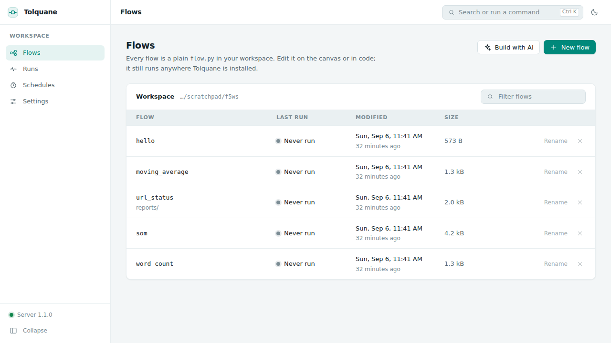
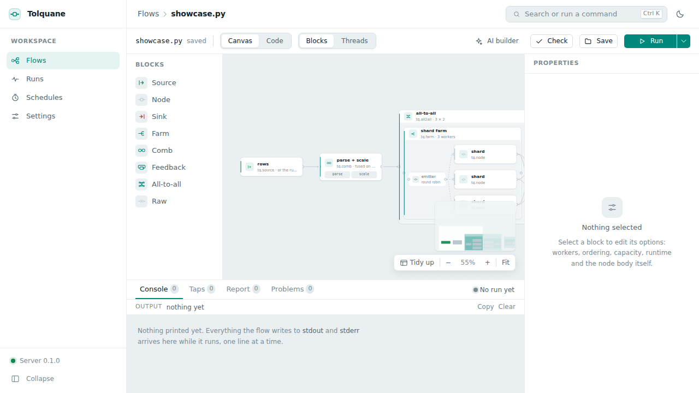
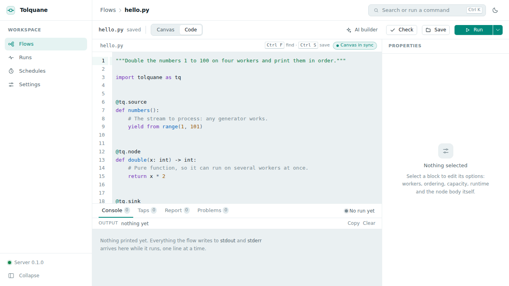
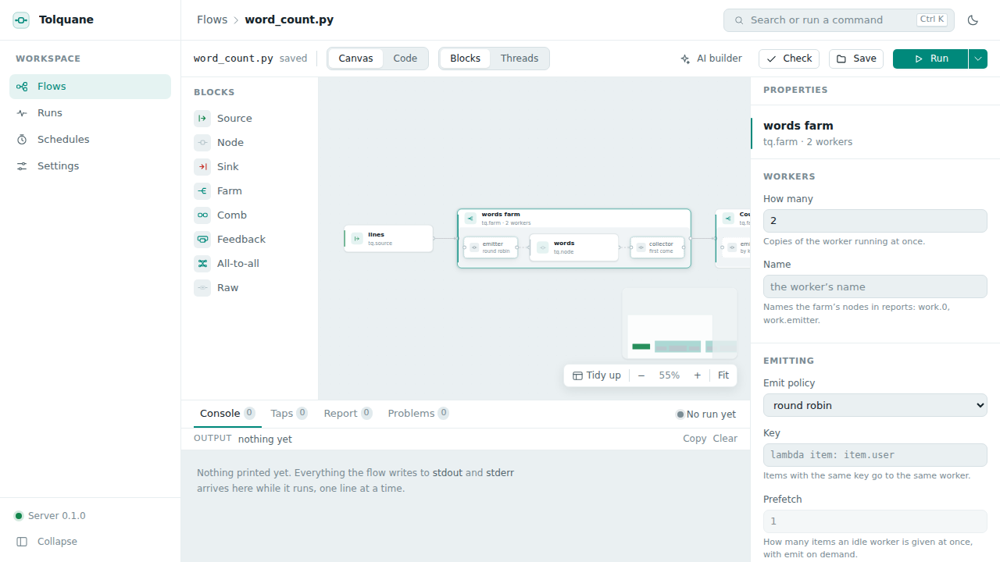
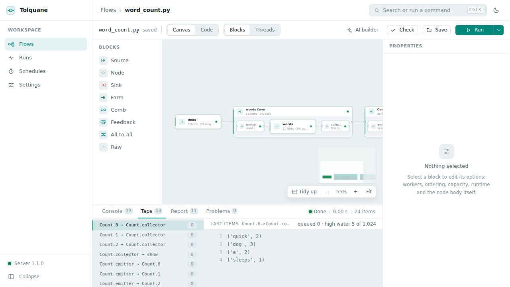
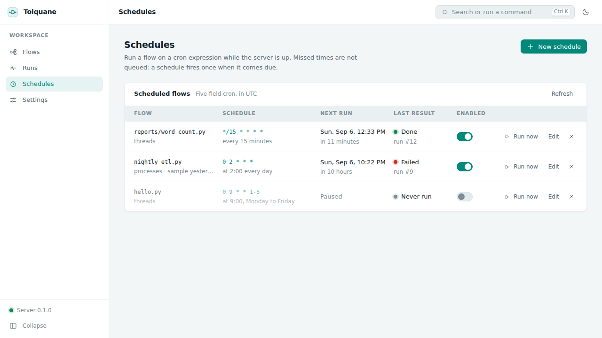
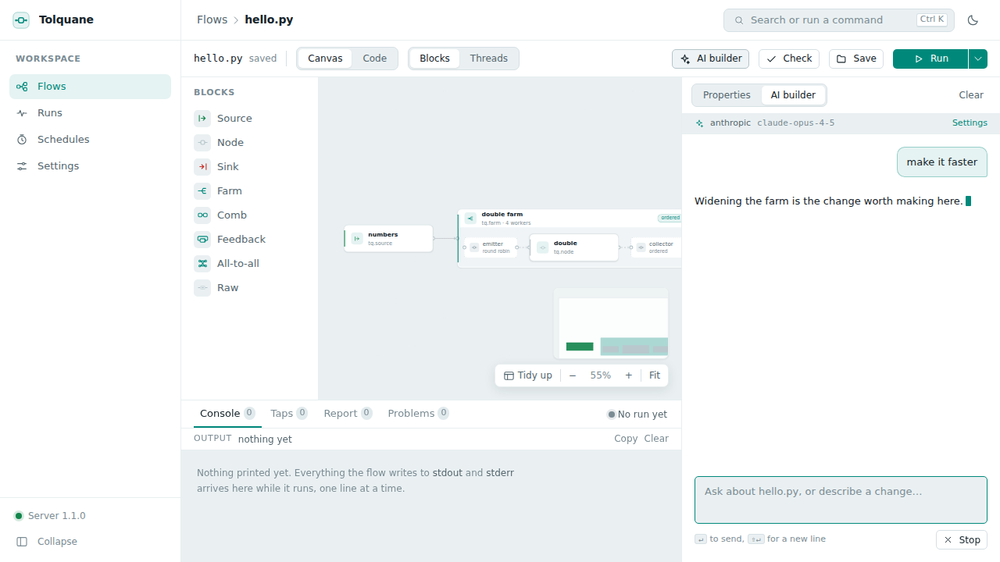
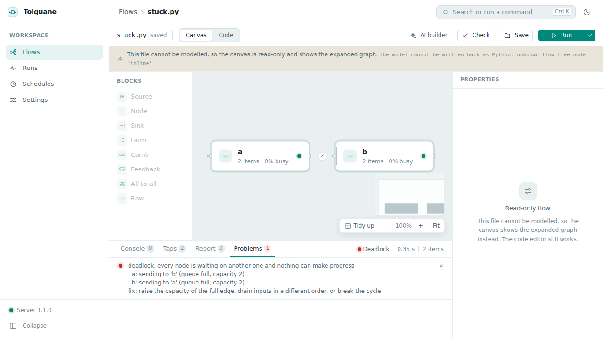

# Tolquane Web: the user guide

Tolquane Web is a page for the flows in one directory: a canvas of the blocks, the
Python beside it, runs with live per-node counts, a history, schedules and the AI
builder. It runs on your machine, and the flows it writes are ordinary files.

The file is the artifact and the canvas is a view of it. Every flow is a `flow.py` in
the [house style](style.md), with `build(source=None)` and `main()`, so anything made
here runs with `python flow.py` on any machine that has `pip install tolquane` and
nothing else.

## Install and start

```
pip install "tolquane[web]"
cd ~/flows
tolquane web
```

That starts a server on `127.0.0.1:8765`, opens a browser at it, and takes the current
directory as the *workspace*: the directory whose `.py` files are the flows, and the
working directory every run starts in. `--workspace DIR` picks another one, `--port` a
different port, and `--no-browser` leaves the browser alone. The workspace, host and
port you save on the Settings page are what the *next* `tolquane web` starts with when
no flag says otherwise.

The server has no login because it is on loopback, where only this machine can reach it.
To put it on a shared machine, bind wider and set a token:

```
tolquane web --host 0.0.0.0 --token "$(python -c 'import secrets; print(secrets.token_urlsafe(24))')"
```

Tolquane Web refuses `--host` anything but loopback without `--token`: anyone who can
reach the page can run code as you. Paste the token into the page once, where it asks
for it; the browser keeps it under `localStorage['tolquane.token']` and sends it with
every request from then on. (Setting it by hand is the same thing:
`localStorage.setItem('tolquane.token', '…')` in the developer console.) See
[Security](#security) for what the token does and does not cover.

`tolquane web --check` starts the server, asks `/api/health`, and stops. That is the
line for CI.

## Flows



The first screen lists every `.py` file in the workspace, when it changed, how big it is
and how it last ran. Hidden directories, `__pycache__`, `node_modules`, virtualenvs and
Tolquane Web's own `.tolquane-web/` are left out; so is a symlink pointing out of the
workspace.

**New flow** writes a small template and opens it. **Build with AI** opens the same
editor with the AI panel in front, for describing what you want instead. Clicking a row
opens it; **Rename** moves the file and its layout sidecar together, and the cross
deletes both.

## The editor



The canvas shows *blocks*, not threads: the things you write. A source, a node, a sink,
a farm with its worker inside it, a comb, a feedback loop, an all-to-all pair, and a raw
node. `>>` is an edge. Drag a kind from the palette on the left onto the canvas to add
it, drag from one card's handle to another to connect them, and select a card and press
Delete to remove it.

**Blocks / Threads** switches to the expanded graph — the emitters, the workers, the
collectors, everything that will actually run, the same picture `tq.draw` prints.
It is read-only: it is what the blocks become.

**Tidy up** lays the cards out again (a file with no saved layout is laid out
automatically the first time it opens). The zoom controls and **Fit** are next to it.

### Code, and the two-way sync



**Canvas / Code** switches to the whole file in an editor. The two views are the same
flow:

- An edit on the canvas regenerates the Python. The generated code is what the house
  style asks for and passes `ruff`, and node bodies are kept exactly as written: a round
  trip never reformats what you typed.
- An edit in the code re-parses about half a second after you stop typing, and the
  canvas catches up. The badge by the file name says `Canvas in sync` when it did.

Nothing is ever reverted. If the parser cannot model what you typed, the file stays
exactly as it is and the panel underneath says which line stopped it; the flow drops
to *code-only mode* until it can be modelled again.

`Ctrl S` (`⌘S`) saves. If the file changed on disk since it was opened — you edited it
in another editor, or the AI builder wrote it — saving shows both versions instead of
overwriting.

### The properties panel



Select a card and the panel on the right holds every option that block has: how many
workers, the emit policy (round robin, on demand, broadcast, scatter, by key) and its
key, the collect policy, ordering, prefetch, capacity, the runtime for that block, its
name, and custom emitter and collector ends. The node's own body is editable there too.
Every change goes straight into the code.

### Check

**Check** runs `tq.check` on the flow in a child process and answers with the node and
edge counts, or with the `GraphError` as it stands — Tolquane's errors already say what
to fix. A problem that belongs to one block is marked on that card and listed in the
Problems tab of the drawer.

## Running



**Run** starts the flow in a child process, never in the server, so a flow that hangs
or crashes costs one process and nothing else. The arrow next to it opens the options:

- **Input**: the flow's own source, or one of the samples saved with the flow. **Manage
  samples** is where you add one — a list of JSON values that is fed to `build(source=…)`
  in place of the source node.
- **Runtime**: threads, processes or sync. Sync runs one node at a time in a fixed
  order, which is the one to reach for when something is wrong.
- **Tap items**: keep the last five items that crossed every edge, for the Taps tab.
- **Chrome trace**: write a trace file, downloadable from the report afterwards, that
  opens in Perfetto.

`Ctrl ↵` (`⌘↵`) runs with whatever those options are set to.

While it runs, each card carries its state colour (not started, running, waiting, done,
failed), how many items it has taken and produced, and what percentage of the time it
was busy; each edge carries its queue depth. Waiting is back pressure, not an error.

The drawer at the bottom has four tabs:

- **Console**: everything the flow printed, `stdout` and `stderr`, as it arrives.
- **Taps**: one row per edge, and the last items that crossed it.
- **Report**: the table `tq.run` returns — items in and out, busy and wait time per
  node, the busiest one marked. The trace file downloads from here.
- **Problems**: errors and deadlock reports, each pointing at the card it is about.

**Cancel** sends the run `SIGTERM`, and `SIGKILL` if it has not stopped after
`cancel_grace` seconds.

## Runs

Every run is recorded: the flow, when, how long, the runtime, the trigger (manual, or
the schedule that fired it), the status and the busiest node. Opening one shows its
report and its log — the last 64 KB of what it printed — and **Run again** starts the
same flow on the same runtime with the same sample. The history lives in `~/.tolquane/web.db`.

## Schedules



A schedule is a flow, a five-field cron expression, an optional sample and a runtime.
The editor offers the usual shapes as presets — every few minutes, hourly, daily,
weekdays, weekly, monthly — and a custom field for anything else. Whatever it comes to
is shown back as a sentence with the next five times it fires, so an expression is never
a guess.

Times are the machine's own zone, the one the page names next to the table, not UTC.

Schedules fire only while the server is up, and a time that passed while it was down
does not queue: a schedule that missed four nights fires once, not four times. **Run
now** fires one immediately.

## The same flow, anywhere

Nothing Tolquane Web writes needs Tolquane Web to run:

```
python flow.py                       # or: tolquane run flow.py
scp flow.py server:                  # and it runs there with pip install tolquane
```

The file is the whole flow. `build(source=None)` returns the graph and `main()` runs it,
which is what `tolquane check`, `run`, `explain`, `draw` and `optimize` expect of any
file, and what a `cron` line or a CI job can call. The canvas positions and the samples
are in the sidecar next to it, and a machine that ignores the sidecar loses nothing but
the layout.

## The AI builder



**AI builder** opens a chat beside the editor. It is the same `tolquane.ai.Builder` the
`tolquane build` command uses, given the open flow and the chosen sample as context. It
writes, checks and runs a flow in a scratch directory of its own — never over your open
file — and streams its turns and its tool calls into the panel. When it has written
something, the panel offers the diff and **Apply**, and the canvas updates when you take
it.

The key goes in **Settings → AI builder**: a provider (Anthropic or OpenAI), an optional
model id, and the key itself. Keys are written to `~/.tolquane/web.toml` with owner-only
permissions (mode 600) and never enter the database, a flow, or an answer from the
server — the settings page is only ever told *whether* a key is stored. A key exported
as `ANTHROPIC_API_KEY` or `OPENAI_API_KEY` before starting the server works too, and
needs no setting at all.

## Settings

Everything on the Settings page is kept in the same SQLite database as the runs
(`~/.tolquane/web.db`), except the API keys, which are not:

| Setting | What it does |
|---|---|
| `workspace` | The directory the flows live in, for the next start |
| `default_runtime`, `default_batch` | What a run uses when it does not choose |
| `exec_timeout` | How long a parse, check, draw or optimize child gets (30 s) |
| `max_concurrent_runs` | How many runs may go at once (4); beyond it a run is refused |
| `max_source_bytes` | The largest flow the server will write (2 MB) |
| `cancel_grace` | Seconds between `SIGTERM` and `SIGKILL` on cancel (10) |
| `keep_traces_days` | How long traces and samples survive in `.tolquane-web/` (7) |
| `theme` | Dark, light, or whatever the system says |

Host, port and token are shown but not editable: they are start-up options, so changing
them means restarting with `--host`, `--port` or `--token`.

## What is on disk

For a flow called `hello.py`, in the workspace:

```
hello.py                     the flow: the artifact, and all of it
hello.layout.json            the sidecar: card positions, the viewport, the samples
.tolquane-web/               traces, sample files and the builder's scratch
```

The sidecar is the canvas's own file. Positions never go into the `.py`, so a flow
opened on a machine that has never seen Tolquane Web is laid out automatically and
nothing is missing; deleting the sidecar loses the layout and the samples and nothing
else. Both are worth committing — the sidecar is small, and its samples are the inputs
your flow is tested with.

`.tolquane-web/` is Tolquane Web's own directory and is not worth committing. Traces and
samples in it are cleared at startup once they are older than `keep_traces_days`.

Runs, schedules and settings are in `~/.tolquane/web.db`, and the API keys in
`~/.tolquane/web.toml`.

## Keyboard shortcuts

| Key | Does |
|---|---|
| `Ctrl K` / `⌘K` | The command palette: every action, by name |
| `Ctrl S` / `⌘S` | Save the open flow |
| `Ctrl ↵` / `⌘↵` | Run the open flow |
| `Ctrl Z` / `⌘Z`, `Ctrl Shift Z` or `Ctrl Y` | Undo and redo on the canvas |
| `Ctrl F` / `⌘F` | Find, in the code view |
| `Delete` | Remove the selected card |
| `↵` / `Shift ↵` | Send, and a new line, in the AI panel |
| `Esc` | Close the palette or a dialog |

## Troubleshooting

**The port is in use.** `tolquane web --port 8899`, or stop whatever holds 8765. Another
Tolquane Web is the usual answer; they share the same database, so two of them on one
machine is one too many.

**"The Tolquane server is not reachable".** The banner across the top means the page is
still there but the server is not answering; it retries every five seconds. Start it
again with `tolquane web` in the workspace and the banner goes on its own. Nothing typed
is lost, but nothing can be saved until it is back.

**A flow opens read-only, saying it cannot be modelled.** That is code-only mode. The
file is fine — it is Python the canvas cannot represent, usually a graph built at run
time, a `Graph.link` topology, or a `build()` that does more than compose blocks. The
code editor, Check, Run and the whole drawer work as usual; the canvas shows the
expanded graph read-only instead of the blocks. The banner names what stopped the
parser. To get the canvas back, move the part it cannot read into a node body, or let
the AI builder rewrite the file in the house style.



**A flow hangs.** It will not hang for ever: Tolquane's watchdog notices that every node
is waiting on another one and ends the run with a deadlock report, which arrives in the
Problems tab naming the nodes, what each was waiting for, and the fix — usually a
capacity to raise or a cycle to break. Cancel stops a run that is merely slow. A run
whose child ignores both `SIGTERM` and `SIGKILL` is recorded as failed rather than left
saying "running" for ever.

**Every request answers 401 on a server started with `--token`.** The token in the
browser is missing or wrong. Set it again —
`localStorage.setItem('tolquane.token', '…')` in the developer console, then reload —
or restart the server without `--token` if it is only ever reached from this machine.

**A run is refused with "429".** `max_concurrent_runs` runs are already going. Wait,
cancel one, or raise the limit in Settings.

**The page loads but nothing works, and the browser console says something about the
Content Security Policy.** The policy the server sends allows the app's own scripts and
styles and nothing else; a browser extension injecting into the page is the usual cause.
See below.

## Security

Tolquane Web runs flows: it is a program that executes code you give it, with your
privileges. What it does about that:

- **Loopback by default.** With no `--host`, only this machine can reach it, and no
  login is needed. `--host` anything else is refused unless `--token` is given.
- **One token, everywhere.** With a token set, every route under `/api`, the run
  WebSocket and the AI event stream need it — as `Authorization: Bearer <token>`, or as
  `?token=` on the socket and on a download link, neither of which can set a header.
  Tokens are compared with `hmac.compare_digest`, and never written to a log: a URL that
  carries one is logged with `token=<hidden>`. The static files are served without it,
  since the page is what asks you for the token. Paste it once and the browser keeps it.
- **The workspace is a fence.** Every path a request names is resolved inside the
  workspace, whether it is being read, written, renamed or created. `..`, an absolute
  path, a Windows drive or share, and a symlink whose target is outside are all refused,
  and so is a layout sidecar that points away. The listing skips what it would refuse to
  open.
- **No secrets in a child.** A flow runs in a child process whose environment has had
  `ANTHROPIC_API_KEY`, `OPENAI_API_KEY` and the access token taken out of it, and so do
  the children that parse, check, draw and optimize. The AI builder is the one thing
  that needs a key, and it is handed one directly.
- **Bounded.** At most `max_concurrent_runs` runs at once; a source over
  `max_source_bytes` is refused with 413; a run's events are kept to a bounded number in
  memory, so a flow printing a million lines costs the server nothing (the socket says
  how many events it could not keep, and the log and the report are still whole).
- **Same origin, no CORS.** No `Access-Control-Allow-Origin` header is ever sent, so a
  page on another site cannot read an answer out of this server even from your own
  browser. The app's own page comes with `X-Content-Type-Options: nosniff` and a Content
  Security Policy that allows scripts from this server only (the one inline script the
  built page carries is allowed by its hash), connections to this server and its
  WebSocket, and nothing else. Styles are the single exception: `style-src` allows
  `'unsafe-inline'`, because the code editor and the canvas write their own stylesheets
  into the page as they load.

What it is not: there is no user model, no permissions and no HTTPS. A token is one
shared secret for one trusted person, over plain HTTP. On a shared machine, put it
behind an SSH tunnel (`ssh -L 8765:127.0.0.1:8765 host`) and leave the server on
loopback, which is better than a token on the wire.
